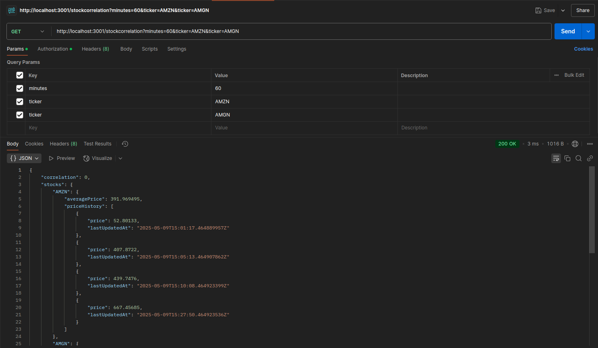

# Stock Price API

Quick Express API for stock price calculations.

## Setup

1. Install dependencies:

   ```
   npm install
   ```

2. Create `.env` file:

   ```
   PORT=3001
   API_BASE_URL=http://20.244.56.144/evaluation-service
   ACCESS_TOKEN=eyJhbGciOiJIUzI1NiIsInR5cCI6IkpXVCJ9...  # Your token here
   CLIENT_ID=5662d827-262b-4846-8453-caac566a906c
   CLIENT_SECRET=suZCnPtfnhkEGEKu
   ```

3. Start server:
   ```
   npm start
   ```

## Endpoints

- `GET /stocks/:ticker?minutes=m&aggregation=average` - Get average stock price
- `GET /stockcorrelation?minutes=m&ticker={T1}&ticker={T2}` - Get correlation


   ## Screenshots

   ### Average Stock Price
   

   ### Correlation 
   

